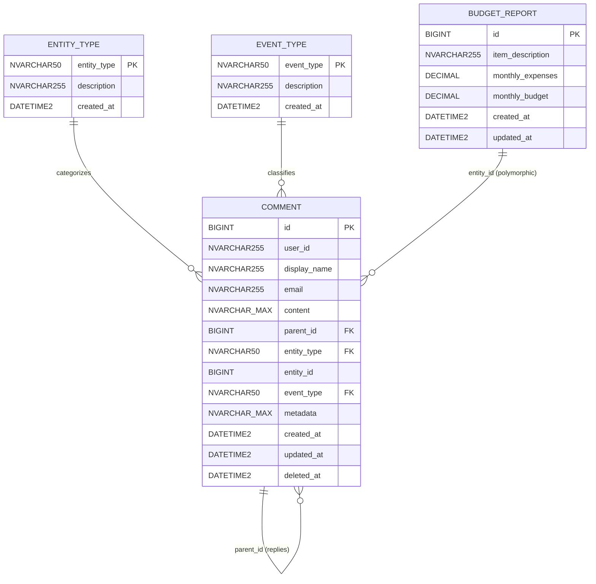
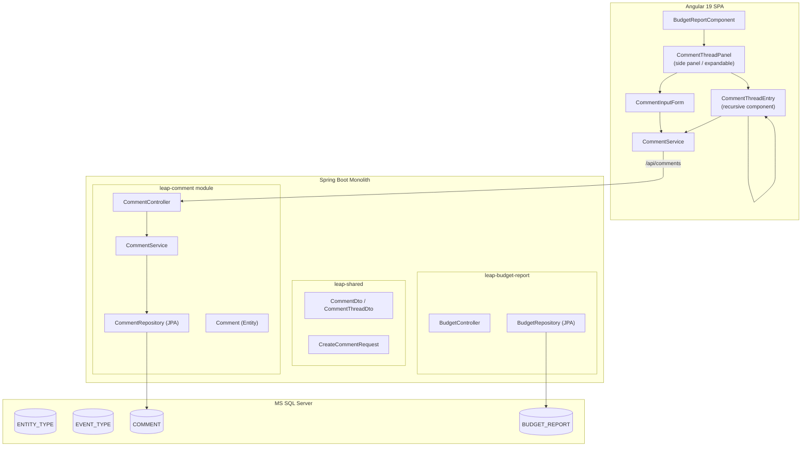
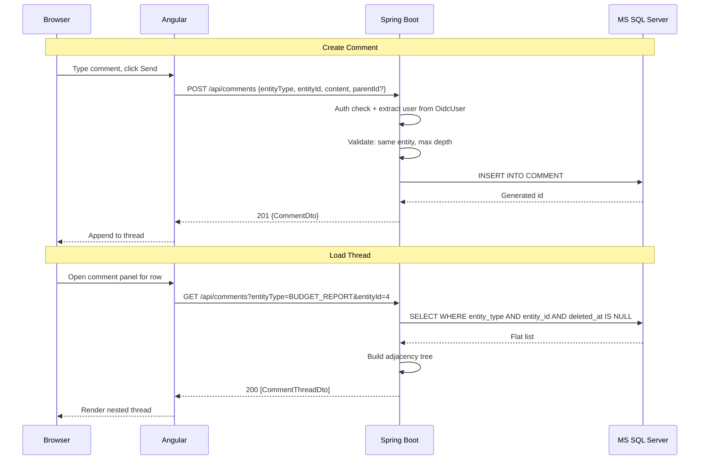

# Conversation & Comment System — Detailed Design

## 1. Executive Summary

This document specifies the design for a threaded conversation system integrated into the LEAP POC. The system supports user comments, nested replies (adjacency list model), polymorphic entity association, and optional audit/event tracking. It is backed by MS SQL Server and served through a new `leap-comment` Spring Boot module.

---

## 2. Design Revisions from Initial Proposal

| Area | Initial Design | Revised Design | Rationale |
|---|---|---|---|
| `user_id` | FK to a `users` table | `NVARCHAR(255)` storing Entra Object ID (OID) + denormalized `display_name`, `email` | No local users table; auth is Entra-only. Avoids unnecessary user sync. |
| `metadata` type | `JSONB` | `NVARCHAR(MAX)` + `ISJSON()` check constraint | MSSQL doesn't support `JSONB`. `NVARCHAR(MAX)` with JSON validation is the equivalent. |
| Soft delete | Not mentioned | `deleted_at DATETIME2 NULL` column | Allows comment hiding/removal without data loss; filtered indexes exclude soft-deleted rows. |
| Edit tracking | Not mentioned | `updated_at DATETIME2` column | Enables "edited" badge in UI and future edit history. |
| Lookup tables | Not specified | `ENTITY_TYPE` and `EVENT_TYPE` reference tables with FK constraints | Enforces referential integrity; self-documenting; prevents typos. |
| Thread depth | "Optional max depth 3-5" | Enforced at API layer via recursive parent walk (max depth = 5) | Simpler than DB triggers; validated before insert. |
| Architecture | Not specified | New Maven module `leap-comment` with JPA entities | Consistent with existing multi-module structure. |
| DB for budget data | In-memory Java `ConcurrentHashMap` | `BUDGET_REPORT` SQL table with seed data | Required for comment FK association; also upgrades budget module to real persistence. |

---

## 3. Database Schema

### 3.1 Entity Relationship Diagram



### 3.2 Table Definitions

#### ENTITY_TYPE (Lookup)
| Column | Type | Constraint | Description |
|--------|------|-----------|-------------|
| entity_type | NVARCHAR(50) | PK | e.g., `BUDGET_REPORT`, `ADJUSTMENT` |
| description | NVARCHAR(255) | NOT NULL | Human-readable description |
| created_at | DATETIME2 | DEFAULT GETUTCDATE() | Creation timestamp |

#### EVENT_TYPE (Lookup)
| Column | Type | Constraint | Description |
|--------|------|-----------|-------------|
| event_type | NVARCHAR(50) | PK | e.g., `COMMENT`, `REPLY`, `ADJUSTMENT` |
| description | NVARCHAR(255) | NOT NULL | Human-readable description |
| created_at | DATETIME2 | DEFAULT GETUTCDATE() | Creation timestamp |

#### BUDGET_REPORT
| Column | Type | Constraint | Description |
|--------|------|-----------|-------------|
| id | BIGINT | PK, IDENTITY | Auto-increment |
| item_description | NVARCHAR(255) | NOT NULL | Budget line item name |
| monthly_expenses | DECIMAL(15,2) | NOT NULL, DEFAULT 0 | Actual spend |
| monthly_budget | DECIMAL(15,2) | NOT NULL, DEFAULT 0 | Budgeted amount |
| created_at | DATETIME2 | DEFAULT GETUTCDATE() | Created |
| updated_at | DATETIME2 | DEFAULT GETUTCDATE() | Last modified |

#### COMMENT
| Column | Type | Constraint | Description |
|--------|------|-----------|-------------|
| id | BIGINT | PK, IDENTITY | Auto-increment |
| user_id | NVARCHAR(255) | NOT NULL | Entra Object ID or `SYSTEM` |
| display_name | NVARCHAR(255) | NULL | Denormalized author name |
| email | NVARCHAR(255) | NULL | Denormalized author email |
| content | NVARCHAR(MAX) | NULL | Comment text (NULL for system events) |
| parent_id | BIGINT | FK → COMMENT.id, NULL | NULL = top-level; set = reply |
| entity_type | NVARCHAR(50) | FK → ENTITY_TYPE, NOT NULL | Target entity type |
| entity_id | BIGINT | NOT NULL | Target entity row ID |
| event_type | NVARCHAR(50) | FK → EVENT_TYPE, DEFAULT 'COMMENT' | Entry classification |
| metadata | NVARCHAR(MAX) | CHECK ISJSON(), NULL | JSON payload for events |
| created_at | DATETIME2 | DEFAULT GETUTCDATE() | Posted at |
| updated_at | DATETIME2 | DEFAULT GETUTCDATE() | Last edited at |
| deleted_at | DATETIME2 | NULL | Soft-delete timestamp |

### 3.3 Indexes
| Index | Columns | Filter | Purpose |
|-------|---------|--------|---------|
| IX_COMMENT_ENTITY | (entity_type, entity_id) INCLUDE (parent_id, created_at) | deleted_at IS NULL | Fetch all comments for an entity |
| IX_COMMENT_PARENT | (parent_id) | deleted_at IS NULL | Fetch child replies |
| IX_COMMENT_USER | (user_id) | deleted_at IS NULL | Fetch comments by user |

---

## 4. Threading Model

**Approach: Adjacency List**

```
BUDGET_REPORT #4 (Travel & Lodging)
├── Comment (id=1, parent_id=NULL)
│     Alice: "Why did Travel exceed budget?"
│     ├── Reply (id=2, parent_id=1)
│     │     Bob: "Unplanned conference trip."
│     │     └── Reply (id=3, parent_id=2)
│     │           Alice: "Submit receipt breakdown."
│     └── (max depth = 5 levels)
├── Comment (id=4, parent_id=NULL)
│     Charlie: "Should we increase the budget?"
└── System Event (id=5, parent_id=NULL, event_type=ADJUSTMENT)
      Budget adjusted: $1,000 → $1,200
```

**Thread Depth Enforcement**: Validated at the API service layer before insert. A recursive walk from `parent_id` to root counts depth; rejects if > `MAX_THREAD_DEPTH` (5).

**Cross-Entity Prevention**: Replies must have the same `(entity_type, entity_id)` as their parent comment. Enforced at the service layer.

---

## 5. API Design

### 5.1 Endpoints

| Method | Path | Auth | Role(s) | Description |
|--------|------|------|---------|-------------|
| GET | `/api/comments?entityType={}&entityId={}` | Required | APP_READ, APP_WRITE, APP_ADMIN | Fetch threaded comments for an entity |
| POST | `/api/comments` | Required | APP_WRITE, APP_ADMIN | Create a comment or reply |
| PUT | `/api/comments/{id}` | Required | APP_WRITE, APP_ADMIN (own comments only) | Edit a comment's content |
| DELETE | `/api/comments/{id}` | Required | APP_ADMIN (any) or owner | Soft-delete a comment |

### 5.2 Request/Response DTOs

#### CreateCommentRequest
```json
{
  "entityType": "BUDGET_REPORT",
  "entityId": 4,
  "content": "Why was this adjusted?",
  "parentId": null
}
```

#### CommentDto (flat)
```json
{
  "id": 1,
  "userId": "aad-oid-xxx",
  "displayName": "Alice Admin",
  "email": "alice@contoso.com",
  "content": "Why did Travel exceed budget?",
  "parentId": null,
  "entityType": "BUDGET_REPORT",
  "entityId": 4,
  "eventType": "COMMENT",
  "metadata": null,
  "createdAt": "2026-03-20T10:15:00Z",
  "updatedAt": "2026-03-20T10:15:00Z",
  "isEdited": false,
  "isOwner": true
}
```

#### CommentThreadDto (nested — returned by GET)
```json
{
  "id": 1,
  "displayName": "Alice Admin",
  "content": "Why did Travel exceed budget?",
  "eventType": "COMMENT",
  "createdAt": "2026-03-20T10:15:00Z",
  "isEdited": false,
  "isOwner": true,
  "replies": [
    {
      "id": 2,
      "displayName": "Bob Writer",
      "content": "Unplanned conference trip.",
      "replies": [
        { "id": 3, "displayName": "Alice Admin", "content": "Submit receipt breakdown.", "replies": [] }
      ]
    }
  ]
}
```

### 5.3 Tree Building (Backend)

```java
// 1. Fetch flat list ordered by created_at ASC
List<Comment> flat = repository.findByEntityTypeAndEntityId(entityType, entityId);

// 2. Build map: id → CommentThreadDto
Map<Long, CommentThreadDto> map = new LinkedHashMap<>();
flat.forEach(c -> map.put(c.getId(), toThreadDto(c)));

// 3. Assemble tree
List<CommentThreadDto> roots = new ArrayList<>();
flat.forEach(c -> {
    CommentThreadDto dto = map.get(c.getId());
    if (c.getParentId() != null && map.containsKey(c.getParentId())) {
        map.get(c.getParentId()).getReplies().add(dto);
    } else {
        roots.add(dto);
    }
});
return roots;
```

---

## 6. Architecture

### 6.1 Module & Component Diagram



### 6.2 Request Flow



---

## 7. Security & Authorization

| Operation | Rule |
|-----------|------|
| Read comments | Authenticated + APP_READ, APP_WRITE, or APP_ADMIN |
| Create comments | APP_WRITE or APP_ADMIN |
| Edit own comment | Original author only (checked via Entra OID match) + APP_WRITE/APP_ADMIN |
| Delete own comment | Original author + APP_WRITE/APP_ADMIN |
| Delete any comment | APP_ADMIN only |

User identity is extracted from the `OidcUser` principal on every request — never from client input.

---

## 8. UI Design

### 8.1 Comment Panel Integration

The comment thread panel appears as a **slide-out side panel** on the Budget Report page. Each budget row has a chat icon button (with comment count badge) that toggles the panel.

### 8.2 Angular Components

| Component | Purpose |
|-----------|---------|
| `CommentThreadPanelComponent` | Side panel container; loads thread for a given entity |
| `CommentEntryComponent` | Recursive component rendering a single comment + its replies (indented) |
| `CommentInputComponent` | Text input + send button; used for both top-level and reply |
| `CommentService` | HTTP service for `/api/comments` CRUD |

### 8.3 Visual Treatment
- **User comments**: Standard card with avatar initials, name, timestamp
- **System events**: Highlighted with a different background color (amber) and gear icon
- **"Edited" badge**: Shown when `updatedAt > createdAt`
- **Indentation**: Each reply level indented 24px (max visual depth = 5)
- **Collapse**: Threads deeper than 3 levels collapsed by default with "Show N more replies"

---

## 9. Constraints & Validation Rules

1. `content` is required for `event_type = 'COMMENT'` or `'REPLY'` (not null, not blank, max 4000 chars)
2. `metadata` is required for `event_type = 'ADJUSTMENT'` (must be valid JSON)
3. Replies must share the same `(entity_type, entity_id)` as their parent
4. Maximum thread depth: 5 levels
5. `entity_type` must exist in the `ENTITY_TYPE` lookup table
6. `event_type` must exist in the `EVENT_TYPE` lookup table
7. Soft-deleted comments' replies remain visible (orphan protection: UI shows "[deleted]" placeholder)

---

## 10. SQL Scripts Reference

| File | Purpose |
|------|---------|
| `docs/sql/V1__schema.sql` | Table creation (ENTITY_TYPE, EVENT_TYPE, BUDGET_REPORT, COMMENT) + indexes |
| `docs/sql/V2__seed_data.sql` | Lookup data, budget seed rows (from InMemoryBudgetRepository), sample comments |
