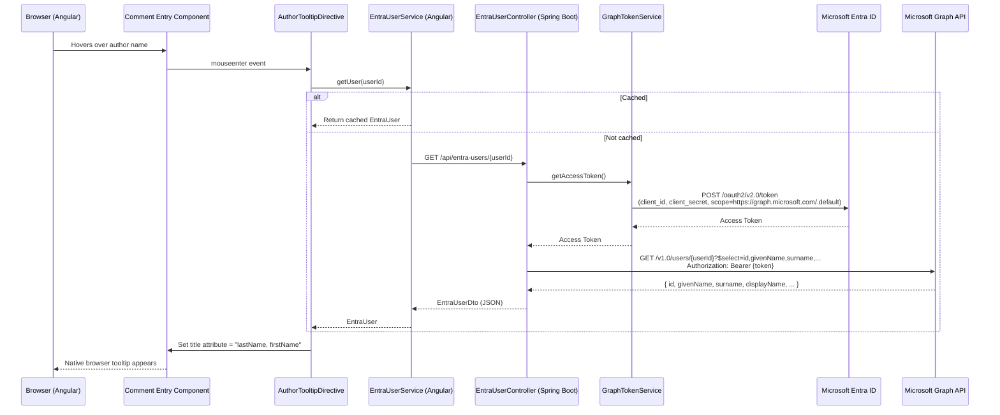

# Entra ID User Lookup — Implementation Guide

## Overview

When a user hovers over a comment author's name, the system fetches the author's **first name** and **last name** from Microsoft Entra ID (via Microsoft Graph) and displays them as a tooltip in the format **"lastName, firstName"**.

The backend uses **app-only authentication** (client credentials flow) — the Graph API call is made with the application's own identity, not the logged-in user's token.

---

## 1. Azure Entra ID Setup

### Prerequisites

| Item | Description |
|------|-------------|
| Entra ID Tenant | An Azure AD / Entra ID tenant |
| App Registration | The same app registration used for OAuth2 login (or a new one) |

### Steps

1. **Open the App Registration** in the [Azure Portal → Entra ID → App registrations](https://portal.azure.com/#view/Microsoft_AAD_IAM/ActiveDirectoryMenuBlade/~/RegisteredApps).

2. **Add a Client Secret** (if not already present):
   - Navigate to **Certificates & secrets → Client secrets → New client secret**.
   - Copy the secret **Value** (not the Secret ID). This is `ENTRA_CLIENT_SECRET`.

3. **Add Microsoft Graph Application Permission**:
   - Navigate to **API permissions → Add a permission → Microsoft Graph → Application permissions**.
   - Search for and add **`User.Read.All`**.
   - Click **Grant admin consent for \<your tenant\>** (requires Global Admin or Privileged Role Administrator).

4. **Verify the permission** shows a green checkmark under "Admin consent granted".

5. **Collect configuration values**:

   | Value | Where to find it |
   |-------|-----------------|
   | `ENTRA_TENANT_ID` | Azure Portal → Entra ID → Overview → **Tenant ID** |
   | `ENTRA_CLIENT_ID` | App registration → Overview → **Application (client) ID** |
   | `ENTRA_CLIENT_SECRET` | App registration → Certificates & secrets → **Value** column |

6. **Set environment variables** (or add to `application.yml`):
   ```
   ENTRA_TENANT_ID=xxxxxxxx-xxxx-xxxx-xxxx-xxxxxxxxxxxx
   ENTRA_CLIENT_ID=xxxxxxxx-xxxx-xxxx-xxxx-xxxxxxxxxxxx
   ENTRA_CLIENT_SECRET=your-client-secret-value
   ```

> **Security Note**: Never commit client secrets to source control. Use environment variables or a secrets manager.

---

## 2. Sequence Diagram



---

## 3. Code Implementation Summary

### 3.1 Backend (Spring Boot)

#### Configuration Properties

**`EntraProperties.java`** — `com.leappoc.app.config`

Binds `app.entra.tenant-id`, `app.entra.client-id`, and `app.entra.client-secret` from `application.yml` using `@ConfigurationProperties(prefix = "app.entra")`.

#### Token Acquisition

**`GraphTokenService.java`** — `com.leappoc.app.service`

- Uses `ClientSecretCredentialBuilder` from the **azure-identity** library.
- Acquires an app-only token for scope `https://graph.microsoft.com/.default` via the OAuth2 client credentials flow.
- Token caching is handled internally by the Azure Identity SDK.

#### User Lookup Service

**`EntraUserLookupService.java`** — `com.leappoc.app.service`

- Gets a token from `GraphTokenService`.
- Calls Microsoft Graph: `GET /v1.0/users/{userId}?$select=id,givenName,surname,displayName,userPrincipalName,mail`.
- Maps `givenName` → `firstName`, `surname` → `lastName`.
- Throws `ResourceNotFoundException` (→ HTTP 404) if Graph returns 404.
- Other Graph errors result in a `RuntimeException` (→ HTTP 500 via `GlobalExceptionHandler`).

#### REST Controller

**`EntraUserController.java`** — `com.leappoc.app.controller`

| Method | Path | Auth | Description |
|--------|------|------|-------------|
| `GET` | `/api/entra-users/{userId}` | `@PreAuthorize("isAuthenticated()")` | Returns `EntraUserDto` |

#### DTO

**`EntraUserDto.java`** — `com.leappoc.shared.dto`

```
{ id, firstName, lastName, displayName, userPrincipalName, mail }
```

#### Dependencies Added (leap-app/pom.xml)

| Dependency | Purpose |
|-----------|---------|
| `spring-boot-starter-webflux` | `WebClient` for outbound HTTP to Graph |
| `azure-identity:1.15.4` | `ClientSecretCredential` for token acquisition |
| `mockwebserver:4.12.0` (test) | Mock Graph API responses in unit tests |

#### application.yml

```yaml
app:
  entra:
    tenant-id: ${ENTRA_TENANT_ID}
    client-id: ${ENTRA_CLIENT_ID}
    client-secret: ${ENTRA_CLIENT_SECRET}
```

---

### 3.2 Frontend (Angular)

#### Entra User Service

**`entra-user.service.ts`** — `core/services`

- Calls `GET /api/entra-users/{userId}`.
- Caches responses per `userId` using a `Map<string, Observable>` with `shareReplay(1)`.
- Silently returns `null` on errors (no disruptive UI experience).

#### Author Tooltip Directive

**`author-tooltip.directive.ts`** — `shared/directives`

- Standalone directive: `[appAuthorTooltip]="comment.userId"`.
- Listens to `mouseenter` on the host element.
- On first hover: calls `EntraUserService.getUser(userId)`.
- On response: sets `element.title` to `"lastName, firstName"`.
- Subsequent hovers are no-ops (fetched flag).

#### Comment Entry Integration

**`comment-entry.component.html`** — the author name element:

```html
<strong class="small" [appAuthorTooltip]="comment.userId">
  {{ comment.displayName || 'Unknown' }}
</strong>
```

---

### 3.3 Unit Tests (Backend)

**`EntraUserLookupServiceTest.java`** — 3 tests using MockWebServer:

| Test | Scenario |
|------|----------|
| `lookupUser_success` | Graph returns user JSON → DTO mapped correctly, Authorization header present |
| `lookupUser_notFound_throwsResourceNotFoundException` | Graph returns 404 → `ResourceNotFoundException` |
| `lookupUser_tokenFailure_propagatesException` | Token service throws → `RuntimeException` propagated |

---

## File Inventory

| Layer | File | Location |
|-------|------|----------|
| Backend Config | `EntraProperties.java` | `leap-app/.../app/config/` |
| Backend Service | `GraphTokenService.java` | `leap-app/.../app/service/` |
| Backend Service | `EntraUserLookupService.java` | `leap-app/.../app/service/` |
| Backend Controller | `EntraUserController.java` | `leap-app/.../app/controller/` |
| Shared DTO | `EntraUserDto.java` | `leap-shared/.../shared/dto/` |
| Backend Test | `EntraUserLookupServiceTest.java` | `leap-app/.../app/service/` (test) |
| Frontend Service | `entra-user.service.ts` | `leap-frontend/src/app/core/services/` |
| Frontend Directive | `author-tooltip.directive.ts` | `leap-frontend/src/app/shared/directives/` |
| Modified | `comment-entry.component.ts` | Added `AuthorTooltipDirective` import |
| Modified | `comment-entry.component.html` | Added `[appAuthorTooltip]` binding |
| Modified | `application.yml` | Added `app.entra.*` properties |
| Modified | `leap-app/pom.xml` | Added webflux, azure-identity, mockwebserver |
