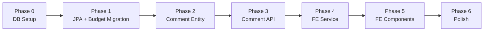

# Conversation & Comment System — Implementation Plan

## Overview

This plan is broken into **7 phases**, each independently testable. Each phase lists the exact files to create/modify, dependencies, and acceptance criteria.

---

## Phase 0: Database Setup
**Goal**: Run SQL scripts on the local MS SQL Server instance.

| # | Task | Details |
|---|------|---------|
| 0.1 | Create database | `CREATE DATABASE LeapPoc` on local MSSQL Developer Edition |
| 0.2 | Run V1__schema.sql | Creates ENTITY_TYPE, EVENT_TYPE, BUDGET_REPORT, COMMENT tables + indexes |
| 0.3 | Run V2__seed_data.sql | Inserts lookup data, budget seed rows, sample comments |
| 0.4 | Verify | Query all 4 tables — confirm data is present |

**Acceptance**: All tables exist, seed data queryable, FK constraints enforced.

---

## Phase 1: Spring Data JPA Integration + Budget Migration
**Goal**: Add MSSQL + JPA to the project, migrate budget module from in-memory to database.

| # | Task | Files |
|---|------|-------|
| 1.1 | Add MSSQL + JPA dependencies | `pom.xml` (parent), `leap-app/pom.xml` |
| 1.2 | Configure datasource | `leap-app/src/main/resources/application.yml` |
| 1.3 | Create JPA entity for BudgetReport | `leap-budget-report/.../model/BudgetReport.java` (rename from BudgetRow, add JPA annotations) |
| 1.4 | Replace BudgetRepository with Spring Data JPA | `leap-budget-report/.../repository/BudgetRepository.java` → extend `JpaRepository` |
| 1.5 | Remove InMemoryBudgetRepository | Delete `InMemoryBudgetRepository.java` |
| 1.6 | Update BudgetServiceImpl | Adjust for JPA repository method names |
| 1.7 | Smoke test | Start app, hit `GET /api/budget` — returns 6 rows from DB |

**Acceptance**: Budget CRUD works against MSSQL. All existing frontend functionality unchanged.

**Dependencies**: Phase 0 complete.

---

## Phase 2: Comment Backend — Module & Entity
**Goal**: Create the `leap-comment` Maven module with JPA entity.

| # | Task | Files |
|---|------|-------|
| 2.1 | Create module directory + POM | `leap-comment/pom.xml` |
| 2.2 | Register module in parent POM | `pom.xml` — add `<module>leap-comment</module>` |
| 2.3 | Add module dependency to leap-app | `leap-app/pom.xml` |
| 2.4 | Create Comment JPA entity | `leap-comment/.../model/Comment.java` |
| 2.5 | Create EntityType JPA entity | `leap-comment/.../model/EntityType.java` |
| 2.6 | Create EventType JPA entity | `leap-comment/.../model/EventType.java` |
| 2.7 | Create CommentRepository (Spring Data JPA) | `leap-comment/.../repository/CommentRepository.java` |
| 2.8 | Verify | App starts, Hibernate validates entity mappings against existing tables |

**Acceptance**: Application boots without schema errors. No API changes yet.

**Dependencies**: Phase 1 complete.

---

## Phase 3: Comment Backend — DTOs, Service, Controller
**Goal**: Implement the comment API endpoints.

| # | Task | Files |
|---|------|-------|
| 3.1 | Create DTOs in leap-shared | `CreateCommentRequest.java`, `CommentDto.java`, `CommentThreadDto.java` |
| 3.2 | Create CommentService interface | `leap-comment/.../service/CommentService.java` |
| 3.3 | Create CommentServiceImpl | `leap-comment/.../service/CommentServiceImpl.java` |
| | — `getThread(entityType, entityId)`: fetch flat, build adjacency tree | |
| | — `createComment(request, oidcUser)`: validate depth + entity match, insert | |
| | — `updateComment(id, content, oidcUser)`: ownership check, update | |
| | — `deleteComment(id, oidcUser)`: ownership/admin check, soft-delete | |
| 3.4 | Create CommentController | `leap-comment/.../controller/CommentController.java` |
| | — `GET /api/comments?entityType=&entityId=` | |
| | — `POST /api/comments` | |
| | — `PUT /api/comments/{id}` | |
| | — `DELETE /api/comments/{id}` | |
| 3.5 | Add @PreAuthorize annotations | READ: APP_READ/WRITE/ADMIN, WRITE: APP_WRITE/ADMIN |
| 3.6 | Test via curl/Postman | All 4 endpoints functional |

**Acceptance**: Full CRUD on comments via API. Thread tree returned correctly nested. Depth limit enforced. Cross-entity threading rejected.

**Dependencies**: Phase 2 complete.

---

## Phase 4: Frontend — Comment Service + Models
**Goal**: Create the Angular HTTP service and TypeScript models.

| # | Task | Files |
|---|------|-------|
| 4.1 | Create TypeScript models | `shared/models/comment.model.ts` |
| | — `CommentDto`, `CommentThreadDto`, `CreateCommentRequest` | |
| 4.2 | Create CommentService | `core/services/comment.service.ts` |
| | — `getThread(entityType, entityId): Observable<CommentThreadDto[]>` | |
| | — `create(request): Observable<CommentDto>` | |
| | — `update(id, content): Observable<CommentDto>` | |
| | — `delete(id): Observable<void>` | |
| 4.3 | Verify | Service compiles, can be injected |

**Acceptance**: `ng build` succeeds. Service ready for component consumption.

**Dependencies**: Phase 3 complete (API available).

---

## Phase 5: Frontend — Comment UI Components
**Goal**: Build the comment thread panel and integrate with Budget Report page.

| # | Task | Files |
|---|------|-------|
| 5.1 | Create CommentInputComponent | `shared/components/comment-input/comment-input.component.ts` |
| | — Text area + Send button | |
| | — `@Output() submitted: EventEmitter<string>` | |
| 5.2 | Create CommentEntryComponent | `shared/components/comment-entry/comment-entry.component.ts` |
| | — Recursive rendering: comment + indented replies | |
| | — Reply button → inline CommentInputComponent | |
| | — Edit button (own comments) → inline edit mode | |
| | — Delete button (own or admin) | |
| | — Visual distinction for system events (ADJUSTMENT) | |
| | — "Edited" badge when `isEdited = true` | |
| 5.3 | Create CommentThreadPanelComponent | `shared/components/comment-thread-panel/comment-thread-panel.component.ts` |
| | — `@Input() entityType: string` | |
| | — `@Input() entityId: number` | |
| | — `@Input() isOpen: boolean` | |
| | — `@Output() closed: EventEmitter<void>` | |
| | — Loads thread on open, displays CommentEntryComponent list + top-level input | |
| 5.4 | Integrate into BudgetReportComponent | Modify `budget-report.component.ts` + `.html` |
| | — Add chat icon button per row (with comment count badge) | |
| | — Include `<app-comment-thread-panel>` with entityType='BUDGET_REPORT' + entityId=row.id | |
| 5.5 | Style | SCSS for indentation, slide panel animation, system event highlight |
| 5.6 | Test | Click chat icon → panel opens → shows thread → post comment → reply → edit → delete |

**Acceptance**: Full conversation UI works on Budget Report page. Threads render correctly nested. System events styled differently.

**Dependencies**: Phase 4 complete.

---

## Phase 6: Polish & Hardening
**Goal**: Edge cases, error handling, UX improvements.

| # | Task | Details |
|---|------|---------|
| 6.1 | Error handling | 403/401 → appropriate messages. Network errors → retry prompt. |
| 6.2 | Empty state | "No comments yet. Start the conversation!" when thread is empty |
| 6.3 | Loading state | Spinner while thread loads |
| 6.4 | Deleted comment display | "[This comment has been removed]" placeholder if a parent is soft-deleted but has visible replies |
| 6.5 | Collapse deep threads | Auto-collapse replies beyond depth 3 with "Show N more replies" link |
| 6.6 | Comment count badge | Show count on the chat icon per budget row (requires a count endpoint or batch fetch) |
| 6.7 | Optimistic UI | Append new comment to thread before server confirms (revert on error) |
| 6.8 | Accessibility | ARIA labels, keyboard navigation for thread |

**Acceptance**: All edge cases handled gracefully. No broken UI states.

**Dependencies**: Phase 5 complete.

---

## Dependency Graph

---

## File Inventory (New Files)

### Backend (Java)
| File | Module | Phase |
|------|--------|-------|
| `leap-comment/pom.xml` | leap-comment | 2 |
| `leap-comment/.../model/Comment.java` | leap-comment | 2 |
| `leap-comment/.../model/EntityType.java` | leap-comment | 2 |
| `leap-comment/.../model/EventType.java` | leap-comment | 2 |
| `leap-comment/.../repository/CommentRepository.java` | leap-comment | 2 |
| `leap-comment/.../service/CommentService.java` | leap-comment | 3 |
| `leap-comment/.../service/CommentServiceImpl.java` | leap-comment | 3 |
| `leap-comment/.../controller/CommentController.java` | leap-comment | 3 |
| `leap-shared/.../dto/CreateCommentRequest.java` | leap-shared | 3 |
| `leap-shared/.../dto/CommentDto.java` | leap-shared | 3 |
| `leap-shared/.../dto/CommentThreadDto.java` | leap-shared | 3 |

### Frontend (TypeScript)
| File | Phase |
|------|-------|
| `shared/models/comment.model.ts` | 4 |
| `core/services/comment.service.ts` | 4 |
| `shared/components/comment-input/comment-input.component.ts` | 5 |
| `shared/components/comment-entry/comment-entry.component.ts` | 5 |
| `shared/components/comment-thread-panel/comment-thread-panel.component.ts` | 5 |

### Modified Files
| File | Phase | Change |
|------|-------|--------|
| `pom.xml` (parent) | 1, 2 | Add MSSQL driver, add `leap-comment` module |
| `leap-app/pom.xml` | 1, 2 | Add JPA + MSSQL deps, add `leap-comment` dep |
| `application.yml` | 1 | Add datasource config |
| `BudgetRow.java` → `BudgetReport.java` | 1 | Add JPA annotations, rename to match table |
| `BudgetRepository.java` | 1 | Extend JpaRepository |
| `InMemoryBudgetRepository.java` | 1 | **DELETE** |
| `BudgetServiceImpl.java` | 1 | Adjust to JPA repository |
| `budget-report.component.ts` + `.html` | 5 | Add chat icon + comment panel integration |

### SQL Scripts
| File | Phase |
|------|-------|
| `docs/sql/V1__schema.sql` | 0 |
| `docs/sql/V2__seed_data.sql` | 0 |
