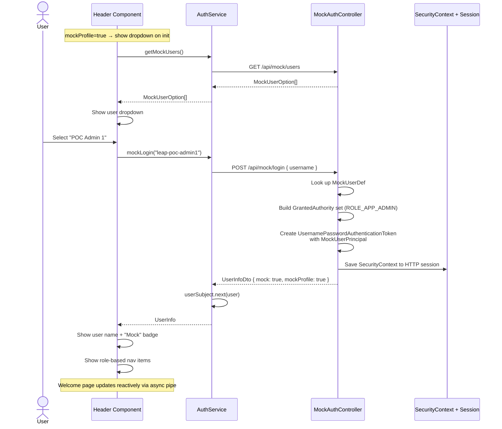
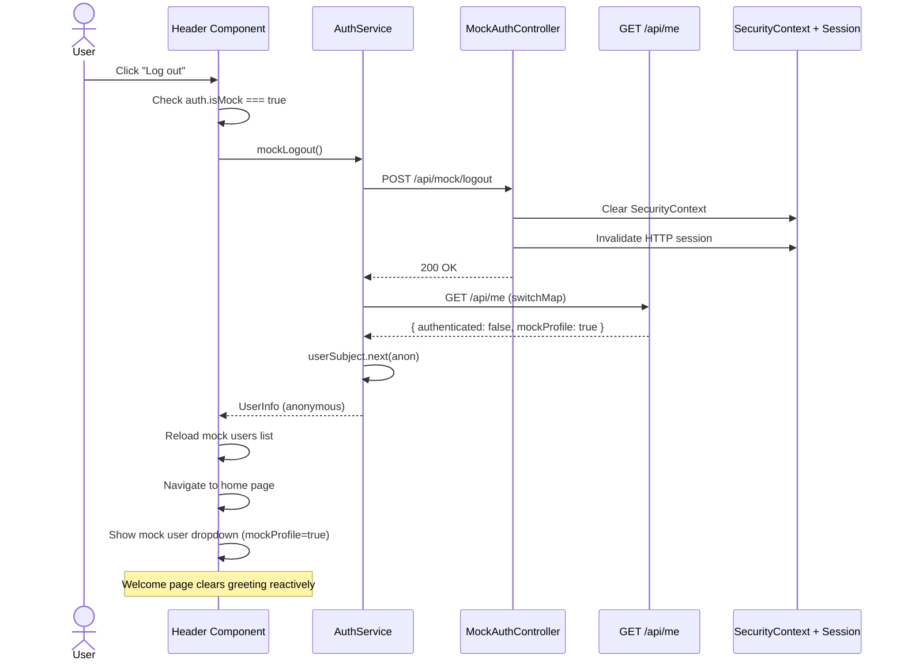
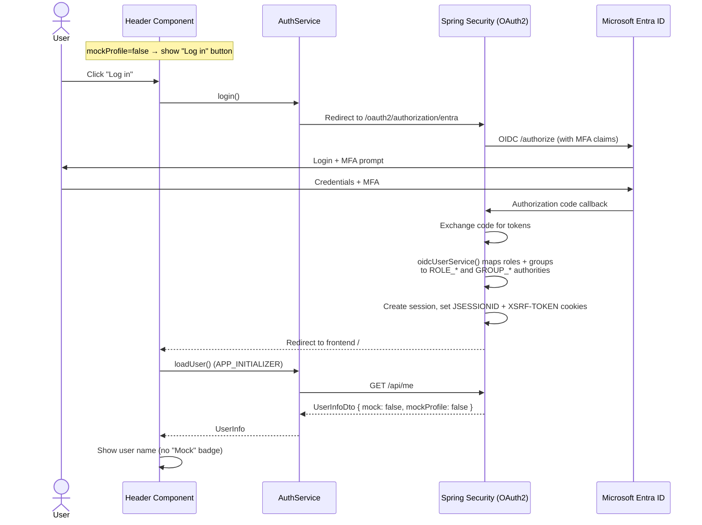
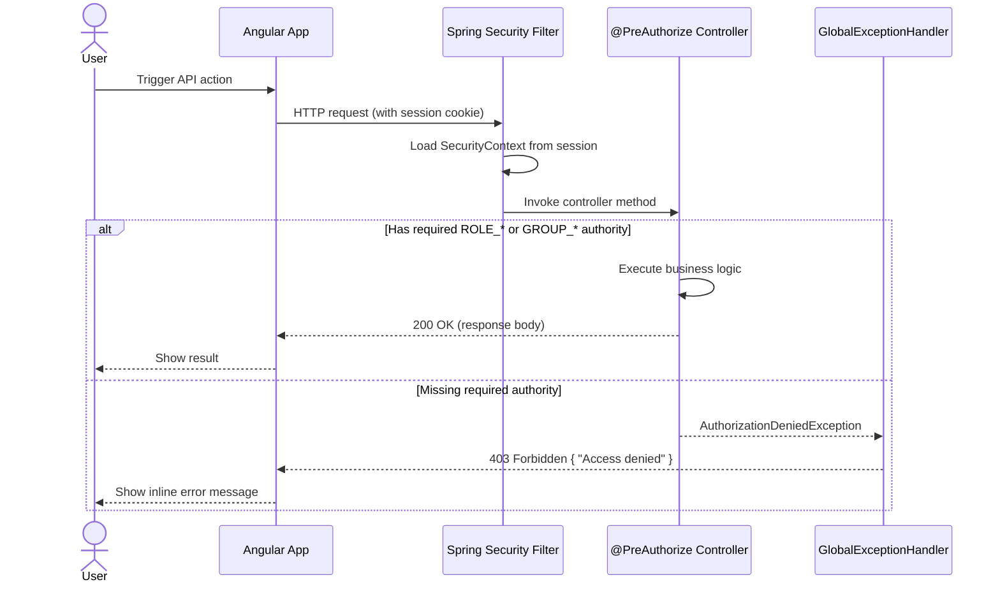

# Mock Authentication & Authorization

## Overview

The LEAP POC uses Microsoft Entra ID (Azure AD) for production authentication via OAuth 2.0 / OIDC.  
Because the Azure free-trial account has a limited lifespan, a **mock authentication mode** was added so the application can be fully tested without a live Entra ID tenant.

Mock and Entra modes are separated by **Spring Boot active profiles**:

| Profile | Backend behavior | Frontend behavior |
|---------|-----------------|-------------------|
| `mock` | `MockSecurityConfig` + `MockAuthController` (no OAuth2) | Mock user dropdown selector |
| *(default / any other)* | `SecurityConfig` with full Entra ID OIDC + MFA | "Log in" button → Entra redirect |

Mock mode replicates the same role-based (RBAC) and group-based authorization that Entra ID provides, including:

- Spring Security `ROLE_*` authorities (from Entra app roles)
- Spring Security `GROUP_*` authorities (from Entra group memberships)
- `@PreAuthorize` method-level security on all API endpoints
- Frontend route guards and UI visibility rules

---

## How to Run

```bash
# Mock mode (no Entra ID required)
mvn spring-boot:run -Dspring-boot.run.profiles=mock

# Entra ID mode (requires ENTRA_CLIENT_ID, ENTRA_CLIENT_SECRET, ENTRA_TENANT_ID)
mvn spring-boot:run
```

Or set the environment variable: `SPRING_PROFILES_ACTIVE=mock`

---

## Mock Users

The following 6 mock users mirror the actual Entra ID setup:

| Username           | Display Name   | Role        | Group       | Effective Access |
|--------------------|----------------|-------------|-------------|------------------|
| `leap-poc-admin1`  | POC Admin 1    | `APP_ADMIN` | —           | Full admin       |
| `leap-poc-admin2`  | POC Admin 2    | —           | `GRP_ADMIN` | Full admin       |
| `leap-poc-write1`  | POC Writer 1   | `APP_WRITE` | —           | Read + Write     |
| `leap-poc-write2`  | POC Writer 2   | —           | `GRP_WRITE` | Read + Write     |
| `leap-poc-read1`   | POC Reader 1   | `APP_READ`  | —           | Read only        |
| `leap-poc-read2`   | POC Reader 2   | —           | `GRP_READ`  | Read only        |

Users with **odd** suffixes (`*1`) demonstrate role-based access. Users with **even** suffixes (`*2`) demonstrate group-based access. Both paths are treated identically by the `@PreAuthorize` expressions and the frontend `hasAnyRoleOrGroup()` check.

---

## Architecture

### Profile-Based Backend Configuration

```
┌─────────────────────────────────────────────────────────┐
│  @Profile("mock")                                       │
│  ┌───────────────────┐  ┌────────────────────────────┐  │
│  │ MockSecurityConfig │  │ MockAuthController         │  │
│  │ - CSRF cookie      │  │ - GET  /api/mock/users     │  │
│  │ - No OAuth2/OIDC   │  │ - POST /api/mock/login     │  │
│  │ - Session logout    │  │ - POST /api/mock/logout    │  │
│  └───────────────────┘  └────────────────────────────┘  │
├─────────────────────────────────────────────────────────┤
│  @Profile("!mock")                                      │
│  ┌───────────────────┐  ┌────────────────────────────┐  │
│  │ SecurityConfig     │  │ EntraGroupConfig           │  │
│  │ - CSRF cookie      │  │ - Maps group Object IDs   │  │
│  │ - OAuth2 OIDC      │  │   to GROUP_* authorities   │  │
│  │ - MFA enforcement  │  │                            │  │
│  │ - OIDC logout      │  │                            │  │
│  └───────────────────┘  └────────────────────────────┘  │
├─────────────────────────────────────────────────────────┤
│  Shared (both profiles)                                 │
│  UserService, UserController, CommentController,        │
│  MockUserPrincipal, GlobalExceptionHandler              │
└─────────────────────────────────────────────────────────┘
```

### Backend Components

| Component | Profile | Description |
|-----------|---------|-------------|
| `MockSecurityConfig` | `mock` | Session-based security, no OAuth2, permits `/api/mock/**` |
| `MockAuthController` | `mock` | REST controller with mock login/logout/users endpoints |
| `SecurityConfig` | `!mock` | Full OAuth2/OIDC with Entra ID, MFA, OIDC logout |
| `EntraGroupConfig` | `!mock` | Maps Entra group Object IDs → `GROUP_*` authorities |
| `application-mock.yml` | `mock` | Excludes `OAuth2ClientAutoConfiguration` |
| `MockUserPrincipal` | shared | Simple principal object (userId, displayName, email) |
| `UserService` | shared | Accepts `Authentication`, dispatches to OIDC or mock builder |
| `UserController` | shared | Returns `UserInfoDto` with `mockProfile` flag from `Environment` |
| `CommentController` | shared | Extracts user from either `OidcUser` or `MockUserPrincipal` |
| `GlobalExceptionHandler` | shared | Returns 403 for `AuthorizationDeniedException` |

### Frontend Components

| Component | Description |
|-----------|-------------|
| `UserInfo` model | `mock?: boolean` (session flag) + `mockProfile?: boolean` (server profile flag) |
| `MockUserOption` model | Interface for the user list: `{ username, displayName, description }` |
| `AuthService` | `isMock`, `isMockProfile`, `getMockUsers()`, `mockLogin()`, `mockLogout()` |
| `HeaderComponent` | Profile-aware: mock user dropdown OR Entra login button, "Mock" badge |
| `WelcomeComponent` | Reactive via `auth.user$ \| async` — updates immediately on mock login/logout |

### `mock` vs `mockProfile` Fields

| Field | Scope | Set when | Frontend use |
|-------|-------|----------|--------------|
| `mockProfile` | Server-wide | `mock` profile is active | Show user selector vs "Log in" button |
| `mock` | Per-session | User logged in via `/api/mock/login` | Show "Mock" badge, route logout correctly |

---

## API Endpoints

All mock endpoints are only available when the `mock` profile is active.

### `GET /api/mock/users`

Returns the list of available mock users.

**Response:**
```json
[
  { "username": "leap-poc-admin1", "displayName": "POC Admin 1", "description": "Role: APP_ADMIN" },
  { "username": "leap-poc-admin2", "displayName": "POC Admin 2", "description": "Group: GRP_ADMIN" },
  ...
]
```

### `POST /api/mock/login`

Authenticates as a mock user. Creates a server-side HTTP session with the appropriate Spring Security authorities.

**Request:**
```json
{ "username": "leap-poc-admin1" }
```

**Response:**
```json
{
  "displayName": "POC Admin 1",
  "email": "admin1@leappoc.mock",
  "roles": ["APP_ADMIN"],
  "groups": [],
  "authenticated": true,
  "mock": true,
  "mockProfile": true
}
```

### `POST /api/mock/logout`

Clears the `SecurityContext` and invalidates the HTTP session.

**Response:** `200 OK` (empty body)

### `GET /api/me` (shared, both profiles)

Returns the current user info. The `mockProfile` flag tells the frontend which UI to render.

**Response (mock profile, not logged in):**
```json
{
  "authenticated": false,
  "mockProfile": true
}
```

**Response (Entra profile, not logged in):**
```json
{
  "authenticated": false,
  "mockProfile": false
}
```

---

## Sequence Diagrams

### Mock Login Flow (`mock` profile)



### Mock Logout Flow (`mock` profile)



### Entra ID Login Flow (`!mock` profile)



### API Authorization Flow (applies to both profiles)



---

## Key Design Decisions

1. **Profile-based separation** — Mock and Entra configurations live in separate `@Profile`-annotated classes. The `mock` profile excludes OAuth2 auto-configuration entirely via `application-mock.yml`, so the app starts without any Entra environment variables. The `!mock` (default) profile uses the full Entra OIDC flow with MFA enforcement.

2. **Session-based, not token-based** — Mock login creates a real HTTP session with `SecurityContext`, identical to what Entra OIDC creates. All `@PreAuthorize` checks, CSRF protection, and session management work without any code branching.

3. **Same authority format** — Mock users get the exact same `ROLE_APP_*` and `GROUP_GRP_*` authority strings as real Entra users. No additional `if-mock` logic is needed anywhere in the authorization layer.

4. **Profile-aware frontend** — The `/api/me` response includes `mockProfile: true/false`. The frontend uses this to decide which UI to show:
   - `mockProfile=true` → mock user dropdown selector (no "Log in" button)
   - `mockProfile=false` → "Log in" button (no mock selector)

5. **Clean isolation** — When running without the `mock` profile, `MockAuthController`, `MockSecurityConfig`, and their endpoints don't exist at all — zero mock code is loaded. The `/api/mock/**` URLs return 404.

6. **Dual principal support** — Controllers accept `Authentication` instead of `@AuthenticationPrincipal OidcUser`, then use `instanceof` to extract user details from either `OidcUser` or `MockUserPrincipal`. This keeps both flows unified in a single code path.

7. **Two DTO flags** — `UserInfoDto` carries two boolean fields:
   - `mock` — per-session: "this user was mock-authenticated" → shows "Mock" badge, routes logout to `/api/mock/logout`
   - `mockProfile` — server-wide: "the server is in mock mode" → controls which login UI the frontend renders

8. **Reactive welcome page** — The welcome component uses `auth.user$ | async` pipe so it updates immediately when a mock user is selected or logged out, without requiring a page reload.

---

## Files Changed

| File | Module | Change |
|------|--------|--------|
| `MockSecurityConfig.java` | leap-app | **New** — `@Profile("mock")` security config (no OAuth2) |
| `MockAuthController.java` | leap-app | **New** — `@Profile("mock")` mock login/logout/users endpoints |
| `MockUserPrincipal.java` | leap-shared | **New** — Principal for mock sessions |
| `application-mock.yml` | leap-app | **New** — Excludes OAuth2 auto-configuration |
| `SecurityConfig.java` | leap-app | Added `@Profile("!mock")`, removed `/api/mock/**` permit |
| `EntraGroupConfig.java` | leap-app | Added `@Profile("!mock")` |
| `UserInfoDto.java` | leap-shared | Added `mock` + `mockProfile` fields |
| `UserService.java` | leap-user-management | Accept `Authentication`, handle both principal types |
| `UserController.java` | leap-user-management | Reads active profile, sets `mockProfile` on response |
| `CommentController.java` | leap-comment | Extract user from `Authentication` (OIDC or mock) |
| `GlobalExceptionHandler.java` | leap-app | Handle `AuthorizationDeniedException` → 403 |
| `user-info.model.ts` | leap-frontend | Added `mock` + `mockProfile` fields, `MockUserOption` interface |
| `auth.service.ts` | leap-frontend | Added `isMock`, `isMockProfile`, mock login/logout/getUsers |
| `header.component.ts` | leap-frontend | Profile-aware: auto-loads mock users on init, smart logout |
| `header.component.html` | leap-frontend | Mock user dropdown OR "Log in" button based on profile |
| `header.component.scss` | leap-frontend | Style for mock user selector |
| `welcome.component.html` | leap-frontend | Reactive via `auth.user$ \| async` pipe |
