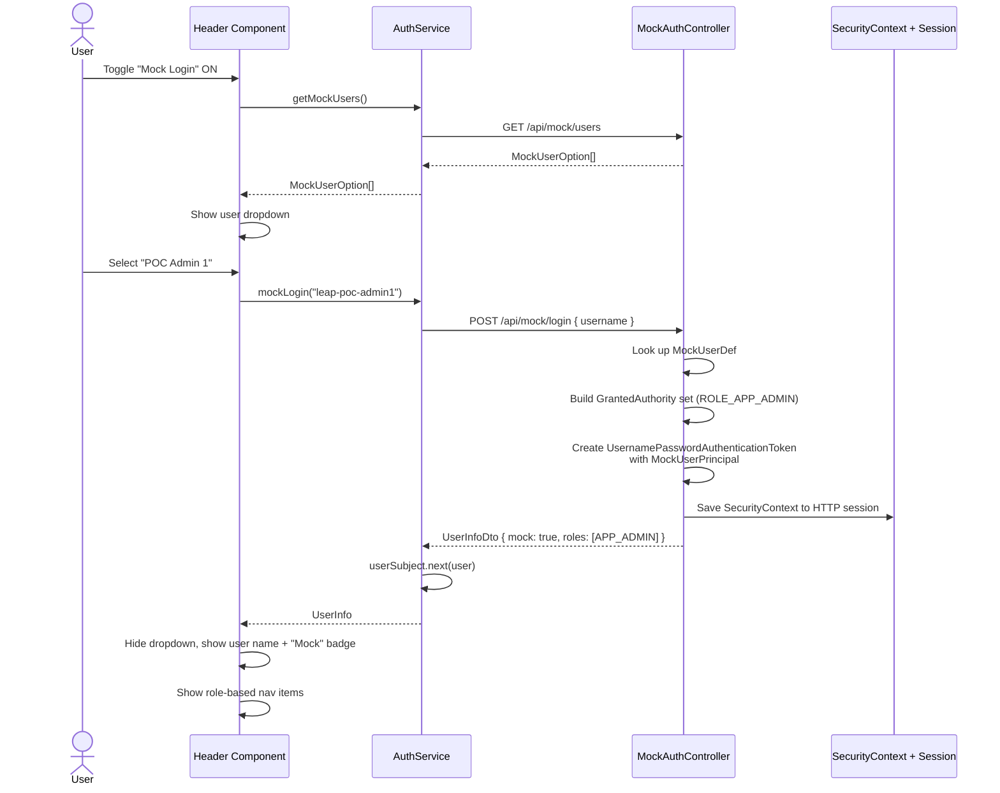
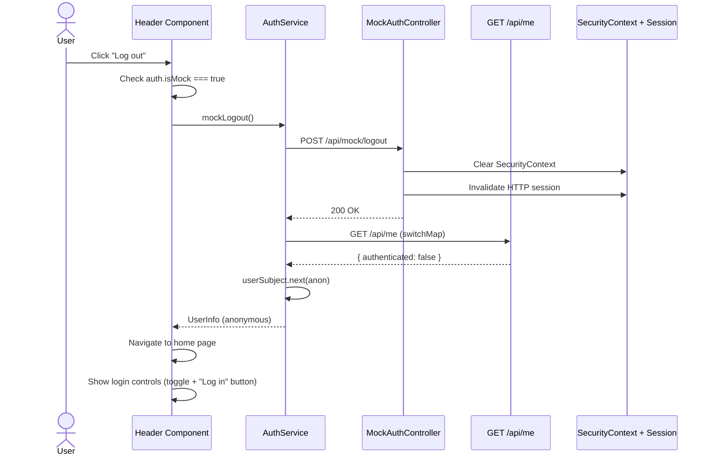
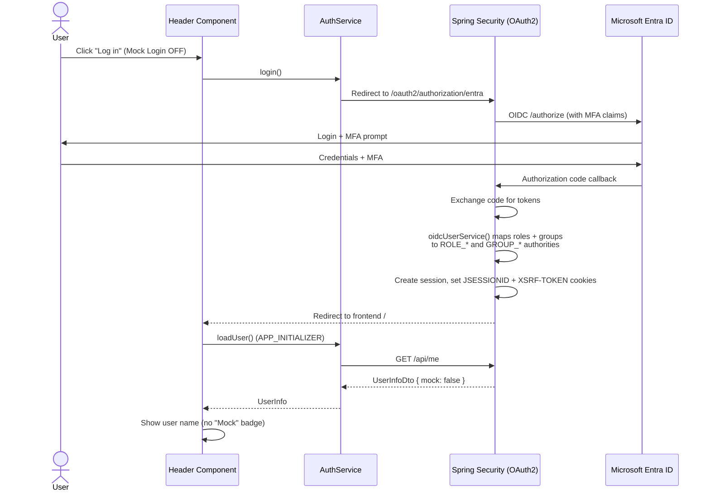
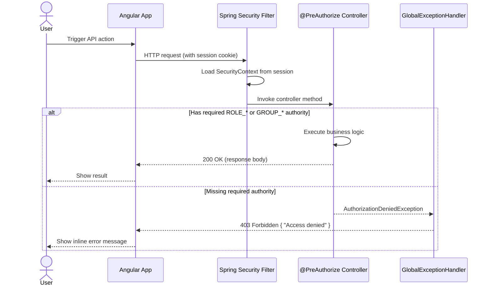

# Mock Authentication & Authorization

## Overview

The LEAP POC uses Microsoft Entra ID (Azure AD) for production authentication via OAuth 2.0 / OIDC.  
Because the Azure free-trial account has a limited lifespan, a **mock authentication mode** was added so the application can be fully tested without a live Entra ID tenant.

Mock mode replicates the same role-based (RBAC) and group-based authorization that Entra ID provides, including:

- Spring Security `ROLE_*` authorities (from Entra app roles)
- Spring Security `GROUP_*` authorities (from Entra group memberships)
- `@PreAuthorize` method-level security on all API endpoints
- Frontend route guards and UI visibility rules

Users can switch between **Entra ID login** and **Mock Login** at any time via a toggle in the header navbar.

---

## Mock Users

The following 6 mock users mirror the actual Entra ID setup:

| Username           | Display Name   | Role        | Group       | Effective Access |
|--------------------|----------------|-------------|-------------|------------------|
| `leap-poc-admin1`  | POC Admin 1    | `APP_ADMIN` | —           | Full admin       |
| `leap-poc-admin2`  | POC Admin 2    | —           | `GRP_ADMIN` | Full admin       |
| `leap-poc-write1`  | POC Writer 1   | `APP_WRITE` | —           | Read + Write     |
| `leap-poc-write2`  | POC Writer 2   | —           | `GRP_WRITE` | Read + Write     |
| `leap-poc-read1`   | POC Reader 1   | `APP_READ`  | —           | Read only        |
| `leap-poc-read2`   | POC Reader 2   | —           | `GRP_READ`  | Read only        |

Users with **odd** suffixes (`*1`) demonstrate role-based access. Users with **even** suffixes (`*2`) demonstrate group-based access. Both paths are treated identically by the `@PreAuthorize` expressions and the frontend `hasAnyRoleOrGroup()` check.

---

## Architecture

### Backend

| Component | Description |
|-----------|-------------|
| `MockAuthController` | REST controller at `/api/mock/*` with three endpoints |
| `MockUserPrincipal` | Simple principal object (userId, displayName, email) stored in the `SecurityContext` |
| `SecurityConfig` | Permits `/api/mock/**` as public (no authentication required) |
| `UserService` | Accepts `Authentication` (not `OidcUser`), dispatches to OIDC or mock builder |
| `UserController` | Passes `Authentication` to `UserService.buildUserInfo()` |
| `CommentController` | Extracts userId/displayName/email from either `OidcUser` or `MockUserPrincipal` |

### Frontend

| Component | Description |
|-----------|-------------|
| `UserInfo` model | Added optional `mock?: boolean` field |
| `MockUserOption` model | Interface for the user list: `{ username, displayName, description }` |
| `AuthService` | Added `isMock`, `getMockUsers()`, `mockLogin()`, `mockLogout()` |
| `HeaderComponent` | Toggle switch UI, mock user dropdown selector, "Mock" badge, smart logout routing |

---

## API Endpoints

### `GET /api/mock/users`

Returns the list of available mock users.

**Response:**
```json
[
  { "username": "leap-poc-admin1", "displayName": "POC Admin 1", "description": "Role: APP_ADMIN" },
  { "username": "leap-poc-admin2", "displayName": "POC Admin 2", "description": "Group: GRP_ADMIN" },
  ...
]
```

### `POST /api/mock/login`

Authenticates as a mock user. Creates a server-side HTTP session with the appropriate Spring Security authorities.

**Request:**
```json
{ "username": "leap-poc-admin1" }
```

**Response:**
```json
{
  "displayName": "POC Admin 1",
  "email": "admin1@leappoc.mock",
  "roles": ["APP_ADMIN"],
  "groups": [],
  "authenticated": true,
  "mock": true
}
```

### `POST /api/mock/logout`

Clears the `SecurityContext` and invalidates the HTTP session.

**Response:** `200 OK` (empty body)

---

## Sequence Diagrams

### Mock Login Flow



### Mock Logout Flow



### Entra ID Login Flow (for comparison)



### API Authorization Flow (applies to both Mock and Entra)



---

## Key Design Decisions

1. **Session-based, not token-based** — Mock login creates a real HTTP session with `SecurityContext`, identical to what Entra OIDC creates. This means all `@PreAuthorize` checks, CSRF protection, and session management work without any code branching.

2. **Same authority format** — Mock users get the exact same `ROLE_APP_*` and `GROUP_GRP_*` authority strings as real Entra users. No additional `if-mock` logic is needed anywhere in the authorization layer.

3. **Frontend-controlled toggle** — The mock/real switch is purely a UI concern. The backend doesn't need a "mock mode" flag — it simply exposes mock endpoints alongside the regular OIDC flow. Both can coexist.

4. **No mock in production** — For a production deployment, the `/api/mock/**` endpoints could be disabled via a Spring profile or removed entirely. In the POC context, they are always available.

5. **Dual principal support** — Controllers accept `Authentication` instead of `@AuthenticationPrincipal OidcUser`, then use `instanceof` to extract user details from either `OidcUser` or `MockUserPrincipal`. This keeps both flows unified in a single code path.

6. **`mock` flag in UserInfoDto** — The DTO includes a `mock: true` field so the frontend can:
   - Display a "Mock" badge next to the user name
   - Route logout to `POST /api/mock/logout` instead of Spring's OIDC logout (which would attempt to redirect to Entra's `end_session_endpoint`)

---

## Files Changed

| File | Module | Change |
|------|--------|--------|
| `MockAuthController.java` | leap-app | **New** — Mock login/logout/users endpoints |
| `MockUserPrincipal.java` | leap-shared | **New** — Principal for mock sessions |
| `SecurityConfig.java` | leap-app | Permit `/api/mock/**` |
| `UserInfoDto.java` | leap-shared | Added `mock` field |
| `UserService.java` | leap-user-management | Accept `Authentication`, handle both principal types |
| `UserController.java` | leap-user-management | Pass `Authentication` instead of `OidcUser` |
| `CommentController.java` | leap-comment | Extract user from `Authentication` (OIDC or mock) |
| `GlobalExceptionHandler.java` | leap-app | Handle `AuthorizationDeniedException` → 403 |
| `user-info.model.ts` | leap-frontend | Added `mock` field + `MockUserOption` interface |
| `auth.service.ts` | leap-frontend | Added `isMock`, mock login/logout/getUsers methods |
| `header.component.ts` | leap-frontend | Mock toggle logic, smart logout routing |
| `header.component.html` | leap-frontend | Toggle switch, user dropdown, "Mock" badge |
| `header.component.scss` | leap-frontend | Style for mock user selector |
